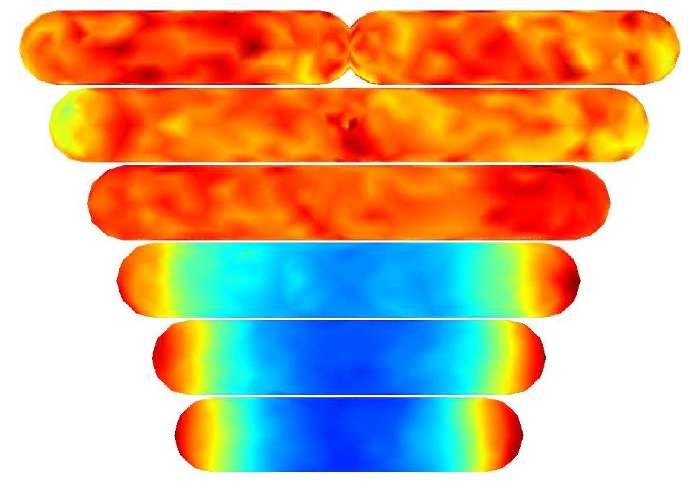



_See also:_ [CV (pdf)](../files/shortCV_Engblom.pdf).

### Research

I am particularly interested in Scientific Computing in the intersection with Data-driven research and Data Science. I have extensive experiences in many aspects of Scientific Computing in general, in Numerical Modeling and -Analys in particular, as well as to some extent in High-Performance Computing. My main focus of applications are in the Biosciences at broad, but I've also taken an interest in traditional computational Engineering applications.  
  
**Current active research projects** include Bayesian approaches for
compute intensive data-driven models in epidemics, including in
particular _prediction_, and multiscale modeling and parameterization
of living cells, where spatial stochasticity is an important aspect of
the modeling.

I am currently the main supervisor for 3 PhD-students:

*   [Erik Blom](https://www.it.uu.se/katalog/eribl985) (started 2021). Eriks project is _Scalable computational modeling of living cells_.
*   [Gesina Menz](https://www.it.uu.se/katalog/gesme856) (started 2022). Gesinas project is _Data-driven modeling of living cells_.
*   [Vaishnavi Divya Shridar](https://www.it.uu.se/katalog/vaish555) (started 2024). Divyas project is _Towards model-based analysis in wastewater epidemiology: the specifics of antimicrobial resistance_.

I was the main advisor of

*   [Robin Marin](http://katalog.uu.se/empinfo/?id=N17-232) who successfully defended his thesis [Computational Modeling, Parameterization, and Evaluation of the Spread of Diseases](http://uu.diva-portal.org/smash/record.jsf?pid=diva2:1654329) (2022).
*   [Jing Liu](https://katalog.uu.se/empinfo/?id=N12-1883) who successfully defended her thesis [Towards Fast and Robust Algorithms in Flash X-ray single-particle Imaging](http://uu.diva-portal.org/smash/record.jsf?pid=diva2:1393531) (2020). This project was run joint with [Janos Hajdu's group](http://xray.bmc.uu.se/hajdu/) at the Department of Cell and Molecular Biology.
*   [Pavol Bauer](http://www.it.uu.se/katalog/pavpa354) who successfully defended his thesis [Parallelism in Event-Based Computations with Applications in Biology](http://uu.diva-portal.org/smash/record.jsf?pid=diva2:1151116) (2017).

I am also the secondary advisor for [Anna Frigge](https://www.it.uu.se/katalog/annfr888), [Alfred Andersson](https://katalog.uu.se/empinfo/?id=N19-1437), and [Helena Andersson](https://www.it.uu.se/katalog/helan424?lang=sv). I was previously the secondary advisor of

*   [Adrien Coulier](http://www.it.uu.se/katalog/adrco749). PhD thesis [Multiscale Modeling in Systems Biology: Methods and Perspectives](http://uu.diva-portal.org/smash/record.jsf?pid=diva2%3A1554586&dswid=7457) (2021).
*   [Afshin Zafari](http://www.it.uu.se/katalog/afsza949). PhD thesis [Advances in Task-Based Parallel Programming for Distributed Memory Architectures](http://uu.diva-portal.org/smash/record.jsf?pid=diva2%3A1173783) (2018).
*   [Stefan Widgren](http://www.slu.se/sv/om-slu/kontakta-slu/sok/sok-anstalld/personpresentation/?emp=8961AF682A8CAA5230626B3E8C357AA4). PhD thesis [Studies on verotoxigenic Escherichia coli O157 in Swedish cattle. From sampling to disease spread modelling](http://pub.epsilon.slu.se/13821/) (2016).
*   [Lina Meinecke](http://www.it.uu.se/katalog/linme981). PhD thesis [Stochastic Simulation of Multiscale Reaction-Diffusion Models via First Exit Times](http://urn.kb.se/resolve?urn=urn%3Anbn%3Ase%3Auu%3Adiva-284085) (2016).
*   [Marcus Holm](http://www.it.uu.se/katalog/marlu734). Licentitate
    thesis [Scientific computing on hybrid
    architectures](http://urn.kb.se/resolve?urn=urn:nbn:se:uu:diva-200242)
    (2013).

MSc/BSc-theses:

*   [Approximate Bayesian Computation for Data-Driven Epidemiological Models](http://urn.kb.se/resolve?urn=urn:nbn:se:uu:diva-507806) by Christoph Nötzli (2023, MSc Data Science)
*   [Investigating the Estimation of the infection rate and the fraction of infections leading to death in epidemiological simulation](http://urn.kb.se/resolve?urn=urn:nbn:se:uu:diva-506486) by Jakob Gölén (2023, MSc Engineering Physics)
*   [Cell-sorting in grid-based time-continuous cell population models](http://urn.kb.se/resolve?urn=urn:nbn:se:uu:diva-488005) by Joel Olofsson (2022, MSc Engineering Physics)
*   [Computational modelling of quorum sensing using cascade delay](http://urn.kb.se/resolve?urn=urn:nbn:se:uu:diva-476672) by Nils Axelsson and David Mårsäter (2022, BSc Engineering Physics)
*   [Tumörspridning med artificiell evolution: Warburgeffekten och cancercellers metabolism](http://urn.kb.se/resolve?urn=urn:nbn:se:uu:diva-476421) by David Näsström and Marcus Medhage (2022, BSc Engineering Physics)
*   [Towards Hybrid Modeling of Avascular Tumours](https://uu.diva-portal.org/smash/record.jsf?dswid=-3593&pid=diva2%3A1579188) by Erik Blom (2021, MSc Computational Science)
*   [Implementing multithreading for a fast multipole method using OpenMP](https://www.diva-portal.org/smash/get/diva2:1591568/FULLTEXT01.pdf) by Ludwig Ridderstolpe (2021, BSc Computer Science)
*   [Performance of Adaptive Fast Multipole Method in three dimensions for time-dependent problems](http://uu.diva-portal.org/smash/record.jsf?pid=diva2%3A1528341&dswid=-2903) by Zain Nawas (2021, MSc Computational Science)
*   [Comparing Priority Queues with support for priority updates at arbitrary indexes](http://urn.kb.se/resolve?urn=urn:nbn:se:uu:diva-458357) by Erik Granberg (2021, BSc Computer Science)
*   Heterogeneous Multiscale Method in Markovian event-based models -- With applications in tumor modeling by An Khang Bui (2020, MSc Numerische Mechanik, Technical University of Munich)
*   [A parallel implementation of spatially distributed stochastic chemical kinetics](http://urn.kb.se/resolve?urn=urn:nbn:se:uu:diva-458354) by Pontus Melin (2020, BSc Computer Science)
*   [Practical complexity of the Fibonacci heap in a simulation and modelling framework](http://urn.kb.se/resolve?urn=urn:nbn:se:uu:diva-429192) by Elwira Johansson (2020, BSc Computer Science)
*   Bayesian inference in Epidemics: consistency and convergence by Samuel Bronstein (2019, MSc (eq.), Applied Mathematics, ENS Paris)
*   [Bayesian Parametrisation of In Silico Tumour Models](http://urn.kb.se/resolve?urn=urn:nbn:se:uu:diva-382536) by Jonas Radvilas Umaras (2018, MSc Computational Science).
*   [Computational modeling of avascular tumours using a hybrid on-lattice framework for cell-population dynamics](http://urn.kb.se/resolve?urn=urn:nbn:se:uu:diva-354688) by Lina Viklund (2018, MSc Engineering Physics).
*   [Mathematical modeling of interactions between colonic crypts](http://urn.kb.se/resolve?urn=urn:nbn:se:uu:diva-325648) by Martin Edin and Nils Erlanson (2017, BSc Engineering Physics)
*   [Multiscale Stochastic Neuron Modeling: with applications in deep brain stimulation](http://urn.kb.se/resolve?urn=urn:nbn:se:uu:diva-329848) by Aleksandar Senek (2017, MSc Engineering Physics)
*   [Bayesian Parameterization in the spread of Diseases](http://urn.kb.se/resolve?urn=urn:nbn:se:uu:diva-326607) by Robin Eriksson (2017, MSc Engineering Physics)
*   [Computational Stochastic Morphogenesis](http://urn.kb.se/resolve?urn=urn:nbn:se:uu:diva-257096) by Yakup Saygun (2015, MSc Engineering Physics)
*   [High Performance Computing aspects of Single Particle Machine Learning](http://urn.kb.se/resolve?urn=urn:nbn:se:uu:diva-260036) by Marcus Näslund (2015, MSc Computational Science)
*   [Efficient Parameter Inference for Stochastic Chemical Kinetics](https://aaltodoc.aalto.fi/handle/123456789/14089) by Debdas Paul (2014, MSc Theoretical Biological Physics/Computational Systems Biology)
*   [Towards mesoscopic modeling of firing neurons: a feasibility study](http://urn.kb.se/resolve?urn=urn:nbn:se:uu:diva-222876) by Emil Berwald (2014, MSc Engineering Physics)
*   [GPU-Parallel simulation of rigid fibers in Stokes flow](http://urn.kb.se/resolve?urn=urn:nbn:se:uu:diva-226566) by Ronny Eriksson (2014, BSc Computer Science)
*   [Parallelization and performance in simulation of disease spread
    by animal
    transfer](http://urn.kb.se/resolve?urn=urn:nbn:se:uu:diva-167014)
    by Fredrik Pasanen and Magnus Söderling (2012, BSc Computer
    Science)

### Previously

I became an Associate Professor in 2014, being previously promoted to Docent in 2013 in Scientific computing. I originally joined [UPMARC](http://www.upmarc.se) in 2011 with the aim at bringing problems from Scientific Computing into a form suitable to modern multicore/manycore computers, and _vice versa_, to develop and analyze algorithms and techniques suitable to such cards with interesting applications in mind. Research outputs here include, amongst others,machine learning methods in imaging with X-ray lasers, auto-tuning in CPU/GPU implementations of adaptive fast multipole methods, and shared memory approaches for event-based algorithms.  
  
[The Linnaeus center of excellence UPMARC](http://www.it.uu.se/research/upmarc)  
⇒ Focus area [Application Performance](http://www.it.uu.se/research/upmarc/research/algoritm-con)  
⇒ ⇒ Project group [Parallel Algorithms](http://www.it.uu.se/research/upmarc/research/algoritm-con/parallel-algorithms)  
  
Before that, I was a PostDoc at the [the Linné FLOW Centre](http://www.flow.kth.se/) where I started in September 2009 to work on computational modeling of multiphase flow for two immiscible fluids and a [surface active agent](http://en.wikipedia.org/wiki/Surfactant). For example, this would be the correct model when considering a mixture of oil/water and a detergent.  
  
Before that I was also briefly involved in [Anna-Karin Tornberg's](http://www.nada.kth.se/~annak) project concerning simulating fibers suspended in fluids.  
  
As a graduate student I studied methods for computing numerical solutions to stochastic descriptions of chemical reactions. The underlying mathematical description is a [continuous-time Markov chain](http://en.wikipedia.org/wiki/Continuous-time_Markov_process) and the equation governing the probability density is called the [Master Equation](http://en.wikipedia.org/wiki/Master_equation). Unfortunately, the master equation cannot be solved numerically for more than, say, five molecular species due to the exponential growth of work and memory requirements ('curse of dimensionality'). Stochastic descriptions of chemical reactions are needed to describe the chemical processes taking place inside living cells with few copy numbers of each molecular species. Usual models for cell simulation are based on the [reaction rate equations](http://en.wikipedia.org/wiki/Reaction_rate) which form a system of nonlinear ordinary differential equations. Such models ignore the stochastic fluctuations in the cells and are therefore less accurate.  
  
[Computational systems biology group.](http://www.it.uu.se/research/project/csbio)  

I was also involved in a project joint with [the Division for Electricity and Lightning Research, Uppsala University](http://www.el.angstrom.uu.se/meny/eng/index_E.html) called "Electric power generation from winds". The ultimate goal of the project is to provide more efficient wind turbines. I have been working together with Paul Deglaire and, lately, [Anders Goude](http://www.uu.se/findperson.php?uid=N7-1522&lang=en). The work has resulted in a two-dimensional random vortex method simulating fluid flows around general airfoils at a quite high [Reynolds number](http://en.wikipedia.org/wiki/Reynolds_number). My contribution has been focused around a user-friendly and very efficient implementation of the [fast multipole method](http://en.wikipedia.org/wiki/Fast_multipole_method).

<!--
Education
======
* Ph.D in Version Control Theory, GitHub University, 2018 (expected)
* M.S. in Jekyll, GitHub University, 2014
* B.S. in GitHub, GitHub University, 2012

Work experience
======
* Spring 2024: Academic Pages Collaborator
  * Github University
  * Duties includes: Updates and improvements to template
  * Supervisor: The Users

* Fall 2015: Research Assistant
  * Github University
  * Duties included: Merging pull requests
  * Supervisor: Professor Hub

* Summer 2015: Research Assistant
  * Github University
  * Duties included: Tagging issues
  * Supervisor: Professor Git
  
Skills
======
* Skill 1
* Skill 2
  * Sub-skill 2.1
  * Sub-skill 2.2
  * Sub-skill 2.3
* Skill 3

Publications
======
  <ul>
    
  </ul>
  
Talks
======
  <ul>
    
  </ul>
  
Teaching
======
  <ul>
    
  </ul>
  
Service and leadership
======
* Currently signed in to 43 different slack teams
-->
